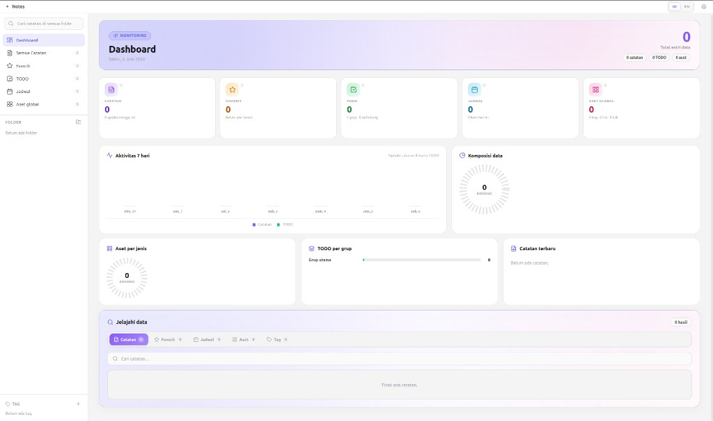

# Notes — Electron Notes App

A desktop notes app with a modern UI, built with **Electron**, **React**, **TypeScript**, and **TipTap** (rich text editor).



## Documentation

| Audience | Start here |
|----------|------------|
| **AI agents / new developers** | [AGENTS.md](AGENTS.md) → [docs/00-INDEX.md](docs/00-INDEX.md) |
| **Product & features** | [docs/01-PRODUCT.md](docs/01-PRODUCT.md) |
| **Architecture** | [docs/02-ARCHITECTURE.md](docs/02-ARCHITECTURE.md) |
| **Task-specific file map** | [docs/06-TASK-GUIDE.md](docs/06-TASK-GUIDE.md) |

Cursor project skill: `.cursor/skills/notes-app/SKILL.md`

> Internal docs under `docs/` are written in Indonesian.

## Features

- **Unlimited folders** — create folders and subfolders with no depth limit
- **Tags** — colored labels to organize notes
- **Favorites & pin** — favorites for filtering; pin to keep notes at the top of the list
- **Global search** — search titles and content across all notes
- **Rich text editor** — bold, italic, underline, strikethrough, font size, headings, lists
- **Images & attachments** — upload, paste, drag-and-drop; PDF/Office preview
- **Kanban TODO** — column board with HTML note cards
- **Schedule** — calendar for notes and scheduled cards
- **Dashboard** — overview and data explorer
- **Export** — Markdown, PDF, HTML, plain text
- **Keyboard shortcuts** — Ctrl+N, Ctrl+F, Ctrl+,, Ctrl+Shift+P/E (see Settings)
- **Bulk delete** — select and delete multiple notes at once
- **14 themes** + classic / focus layout modes
- **SQLite storage** — local `notes.db` with versioned schema migrations
- **Backup & restore** — backup folder (DB + settings + files on disk)

## Running locally

```bash
npm install
npm run dev
```

`npm run dev` opens an Electron window with hot reload.

## Production build

```bash
npm run build
```

Installers are written to the `release/` folder.

### Install / update AppImage (Linux)

```bash
npm run install:app      # copy AppImage to ~/Applications
npm run release:app      # build + copy in one step
npm run install:desktop  # refresh desktop menu entry only
```

## Project structure

```
electron/     → Main process, SQLite, migrations, IPC
src/          → React UI, hooks, components
docs/         → Product docs & agent guides
```

## Keyboard shortcuts

| Shortcut | Action |
|----------|--------|
| Ctrl+N | New note |
| Ctrl+F | Focus search |
| Ctrl+, | Settings |
| Ctrl+Shift+P | Pin / unpin |
| Ctrl+Shift+E | Export Markdown |
| Ctrl+B / Ctrl+I | Bold / Italic (in editor) |

On macOS, use **Cmd** instead of Ctrl.

## Data locations

| Platform | Path |
|----------|------|
| Linux | `~/.config/notes-app/` |
| macOS | `~/Library/Application Support/notes-app/` |
| Windows | `%APPDATA%/notes-app/` |

| File | Contents |
|------|----------|
| `notes.db` | SQLite database |
| `settings.json` | Theme, layout |
| `images/` | Images |
| `attachments/` | File attachments |
