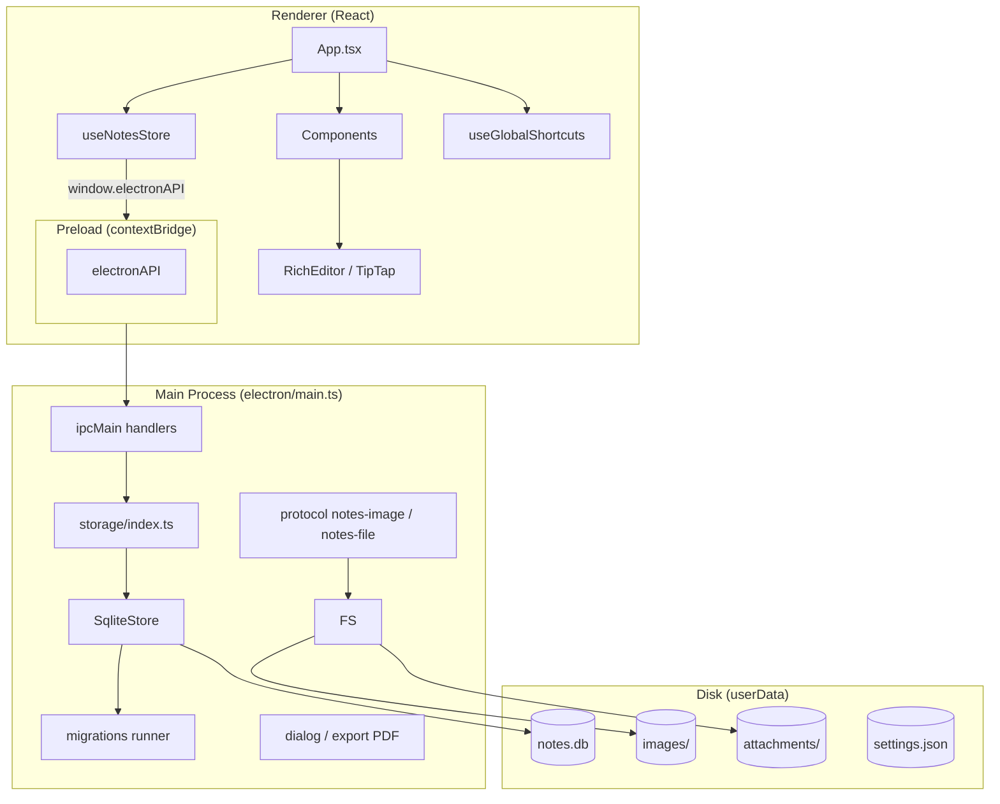

# 02 — Arsitektur Teknis

## Stack

| Lapisan | Teknologi |
|---------|-----------|
| Shell desktop | Electron 34 |
| Bundler | Vite 6 + vite-plugin-electron |
| UI | React 18 + TypeScript |
| Editor | TipTap 2 (@tiptap/react, starter-kit, extensions) |
| Virtual list | @tanstack/react-virtual |
| Ikon | lucide-react |
| ID | uuid v4 |
| Database | SQLite (`better-sqlite3`) via `electron/storage/` |
| Migrasi skema | `electron/storage/migrations/` |

## Diagram lapisan



## Alur startup

1. Electron `app.whenReady` → register protocol `notes-image` / `notes-file` → `createWindow`.
2. Preload expose `window.electronAPI`.
3. `createDataStore()` → buka `notes.db` → `runMigrations()` → siap baca/tulis.
4. React mount → `useNotesStore` panggil `loadData()` (catatan dengan preview ringkas).
5. UI render setelah `loaded === true`.
6. Saat user buka catatan → `ensureNoteContent(noteId)` muat HTML penuh lazy.

## Alur penyimpanan (save)

```
User mengubah catatan/folder/tag/kanban
  → useNotesStore.persist(updater)
  → setState React (optimistic UI)
  → debounce ~400ms (ketik konten)
  → electronAPI.saveData(AppData)
  → ipcMain 'data:save'
  → SqliteStore.save() — transaksi SQLite
  → sync referensi file + purge unused (opsional)
```

Detail migrasi skema: **[09-DB-MIGRATIONS.md](09-DB-MIGRATIONS.md)** (dokumen terpisah).

## Alur gambar & lampiran

```mermaid
sequenceDiagram
  participant E as RichEditor
  participant P as Preload
  participant M as Main
  participant D as Disk + SQLite

  E->>P: uploadImage()
  P->>M: image:upload
  M->>D: salin ke images/ + baris stored_files
  M-->>E: notes-image://uuid

  E->>P: resolveImage(url)
  P->>M: image:resolve
  M->>D: baca file
  M-->>E: data:image/...;base64,...
```

## Alur ekspor catatan

```
NoteEditor → exportNoteFile(title, html, format)
  → IPC exportNote
  → main: dialog save
  → md/html/txt: tulis langsung
  → pdf: hidden BrowserWindow + printToPDF
```

## Keamanan Electron

- `contextIsolation: true`
- `nodeIntegration: false`
- Renderer hanya akses via `electronAPI` di preload
- CSP di `index.html` — `frame-src` / `object-src` mengizinkan `blob:` dan `data:` untuk preview

## Build & output

| Path | Isi |
|------|-----|
| `dist/` | Bundle renderer (Vite) |
| `dist-electron/` | Main + preload compiled |
| `release/` | Installer electron-builder |

Dev: `vite` dengan plugin electron memuat `electron/main.ts` dan hot reload.

**Preload:** Vite menghasilkan `dist-electron/preload.js`. Main process memakai `getPreloadPath()`.

## Dependensi kritis editor

- `@tiptap/starter-kit` — paragraf, heading, list, bold, italic, dll.
- `@tiptap/extension-text-style` + `src/extensions/FontSize.ts` — ukuran font
- `@tiptap/extension-image` — embed gambar
- `@tiptap/extension-underline`, `@tiptap/extension-placeholder`

## Optimasi performa (renderer)

| Teknik | Lokasi |
|--------|--------|
| Virtual list catatan | `NoteList.tsx` |
| Lazy load konten catatan | `useNotesStore.ensureNoteContent` |
| Debounce save saat mengetik | `useNotesStore` |
| Sembunyikan editor saat scroll list | `useListScrollClass` |
| `memo` pada komponen berat | `NoteEditor`, `NoteCard`, dll. |

## Titik perluasan arsitektur

| Kebutuhan masa depan | Pendekatan disarankan |
|---------------------|----------------------|
| Cloud sync | Service layer baru di main; jangan ubah shape `AppData` tanpa versi |
| Perubahan skema DB | [09-DB-MIGRATIONS.md](09-DB-MIGRATIONS.md) |
| Multi-window | Pindah state ke main atau shared store |
