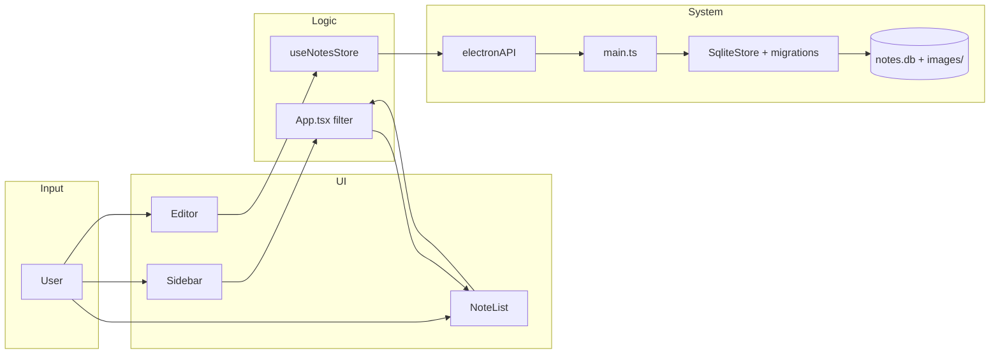

# 08 — Persiapan Terstruktur untuk Agent AI

Dokumen ini menjelaskan **cara menyiapkan** proyek Notes agar agent AI produktif tanpa membaca seluruh codebase.

## Diagram alur produk (end-to-end)



## Checklist persiapan (sekali per mesin / repo)

### 1. Environment

- [ ] Node.js 18+ terpasang
- [ ] `npm install` di root proyek
- [ ] `npm run dev` berhasil membuka jendela Electron

### 2. Artefak dokumentasi (sudah ada di repo)

- [ ] `AGENTS.md` — pintu masuk agent
- [ ] `docs/00` s/d `docs/08` — pengetahuan produk & teknis
- [ ] `docs/09-DB-MIGRATIONS.md` — migrasi skema (terpisah)
- [ ] `docs/08` — dokumen ini

### 3. Konfigurasi Cursor

- [ ] Rule `.cursor/rules/notes-app.mdc` (`alwaysApply: true`)
- [ ] Skill `.cursor/skills/notes-app/SKILL.md`

### 4. Untuk user yang memakai agent

Saat memulai chat baru, kirim prompt singkat:

```
Kerjakan [tugas] di proyek Notes.
Baca AGENTS.md dan docs/06-TASK-GUIDE.md dulu.
Gunakan skill notes-app. Jangan refactor di luar scope.
```

## Matriks: jenis tugas → baca apa

| Jenis tugas | Dokumen wajib | Dokumen opsional | File kode (setelah docs) |
|-------------|---------------|------------------|--------------------------|
| Fitur UI baru | 01, 04, 06 | 07 | Komponen di 06 |
| Bug penyimpanan | 03, 02 | 06 | store + sqliteStore + main |
| Migrasi DB | **09-DB-MIGRATIONS** | 03 | `electron/storage/migrations/` |
| Editor / format | 02, 04 | 01 | RichEditor |
| Folder / tag | 01, 03 | 06 | FolderTree, App |
| Build / deps | 02 | 05 | package.json, vite |
| Onboarding agent | AGENTS, 00, 08 | — | — |

## Ukuran konteks vs membaca kode

| Strategi | Token ~ | Kapan |
|----------|---------|-------|
| Baca AGENTS + 06 + 1 file target | Rendah | Bug kecil, tweak UI |
| Baca 01–04 + 06 | Sedang | Fitur baru di area dikenal |
| Scan seluruh `src/` | Tinggi | **Hindari** — gunakan 05-FILE-MAP |

## Maintenance dokumentasi

Saat merge fitur besar, assignee harus:

1. Update `docs/01-PRODUCT.md` (journey + fitur)
2. Update `docs/03-DATA-MODEL.md` jika ada entitas/IPC
3. Update `docs/09-DB-MIGRATIONS.md` jika ada migrasi skema baru
4. Update tabel fitur di `docs/00-INDEX.md`
5. Tambah baris di `docs/06-TASK-GUIDE.md` jika pola tugas baru (bukan migrasi)
6. Update `reference.md` di skill jika API store berubah

## Troubleshooting agent

| Gejala | Penyebab umum | Solusi |
|--------|---------------|--------|
| Agent edit banyak file | Tidak baca 06 | Minta ikuti TASK-GUIDE |
| Duplikasi types | Tidak baca 07 | Satu sumber: types.ts |
| Data corrupt | Bypass store | Semua mutasi via useNotesStore |
| Gambar hilang | Salah URL | Pakai notes-image:// + resolve |

## Hubungan artefak

```
README.md          → manusia: install & run
AGENTS.md          → agent: router dokumen
docs/*.md          → pengetahuan mendalam per topik
.cursor/rules/     → auto-ingest di setiap chat
.cursor/skills/    → invoke eksplisit untuk tugas kompleks
src/types.ts       → kontrak data runtime
```
