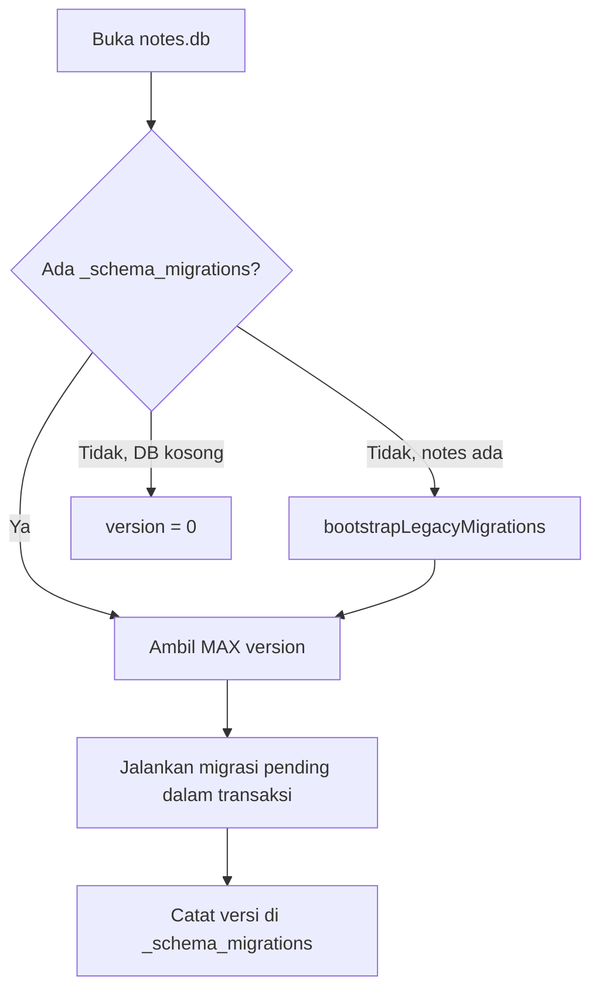

# 09 — Migrasi Database SQLite

**Dokumen ini khusus migrasi skema.** Jangan campur langkah migrasi dengan panduan fitur di dokumen lain.

Untuk entitas, IPC, dan field domain → [03-DATA-MODEL.md](03-DATA-MODEL.md).  
Untuk tugas UI / store → [06-TASK-GUIDE.md](06-TASK-GUIDE.md).

## Lokasi kode

```
electron/storage/migrations/
├── index.ts              # runMigrations(db) — runner
├── types.ts              # interface Migration
├── helpers.ts            # tableExists, columnExists, bootstrap legacy
├── registry.ts           # daftar MIGRATIONS (impor dari versions/)
└── versions/             # ← HANYA skrip migrasi (001, 002, …)
    ├── 001_initial.ts
    └── 002_notes_pinned.ts
```

**Pisah jelas:** folder `versions/` hanya berisi perubahan skema berversi. Runner, helper, dan registry tetap di induk `migrations/`.

## Cara kerja

1. Tabel `_schema_migrations(version, name, applied_at)` mencatat migrasi yang sudah jalan.
2. `runMigrations()` jalankan migrasi dengan `version` lebih besar dari versi terakhir.
3. **DB baru:** 001 → 002 → … berurutan.
4. **DB production lama** (belum punya `_schema_migrations`): bootstrap infer versi dari struktur, lalu lanjutkan pending.



## Aturan wajib

| Aturan | Alasan |
|--------|--------|
| **Jangan ubah** nomor/isi migrasi lama yang sudah release | User production sudah apply versi tersebut |
| **Selalu tambah** file baru di akhir (`003_`, `004_`, …) | Urutan monoton |
| **Daftarkan** di `registry.ts` | Runner hanya baca registry |
| **Jangan** `ALTER TABLE` inline di `sqliteStore.ts` | Satu tempat untuk audit skema |
| Migrasi harus **idempotent** sebisa mungkin | `IF NOT EXISTS`, cek `columnExists` dulu |
| Satu migrasi = **satu perubahan logis** | Mudah debug & rollback mental |

## Menambah migrasi baru

### Langkah

1. Buat `electron/storage/migrations/versions/00N_nama_snake_case.ts`
2. Export konstanta migrasi dengan `version: N` (N = terakhir + 1)
3. Tambah ke array `MIGRATIONS` di `registry.ts`
4. Update query di `sqliteStore.ts` (SELECT / INSERT / UPDATE)
5. Update `src/types.ts` + `electron/normalizeData.ts` jika ada field domain baru
6. Restart dev server (main process harus reload)
7. Verifikasi: buka app → cek `_schema_migrations` atau log tidak error

### Template: tambah kolom

```typescript
// electron/storage/migrations/versions/003_notes_archived.ts
import type { Migration } from '../types';
import { columnExists } from '../helpers';

export const migration003: Migration = {
  version: 3,
  name: 'notes_archived',
  up(db) {
    if (!columnExists(db, 'notes', 'archived')) {
      db.exec(`ALTER TABLE notes ADD COLUMN archived INTEGER NOT NULL DEFAULT 0`);
    }
    db.exec(`CREATE INDEX IF NOT EXISTS idx_notes_archived ON notes(archived)`);
  },
};
```

```typescript
// electron/storage/migrations/registry.ts
import { migration003 } from './versions/003_notes_archived';

export const MIGRATIONS = [migration001, migration002, migration003];
```

### Template: tabel baru

```typescript
export const migration004: Migration = {
  version: 4,
  name: 'note_links',
  up(db) {
    db.exec(`
      CREATE TABLE IF NOT EXISTS note_links (
        id TEXT PRIMARY KEY,
        from_note_id TEXT NOT NULL,
        to_note_id TEXT NOT NULL,
        created_at INTEGER NOT NULL
      );
      CREATE INDEX IF NOT EXISTS idx_note_links_from ON note_links(from_note_id);
    `);
  },
};
```

## Field catatan + migrasi (alur gabungan)

Jika fitur baru butuh kolom DB **dan** UI:

| # | Dokumen / file |
|---|----------------|
| 1 | [03-DATA-MODEL.md](03-DATA-MODEL.md) — dokumentasikan field |
| 2 | `src/types.ts` |
| 3 | **Migrasi** — langkah di dokumen ini |
| 4 | `electron/normalizeData.ts` |
| 5 | `electron/storage/sqliteStore.ts` |
| 6 | `src/hooks/useNotesStore.ts` |
| 7 | Komponen UI (lihat [06-TASK-GUIDE.md](06-TASK-GUIDE.md)) |

## Bootstrap legacy

DB yang dibuat sebelum sistem migrasi (inline `migrateSchema` di `sqliteStore`):

- `bootstrapLegacyMigrations()` jalankan `001` (`CREATE IF NOT EXISTS`) untuk melengkapi tabel yang kurang
- Infer versi: jika kolom `notes.pinned` ada → anggap sudah versi 2
- Catat migrasi 1..N ke `_schema_migrations` tanpa menjalankan ulang `up()` yang sudah implisit ter-apply

**Penting:** jika menambah migrasi baru yang perlu infer legacy, perbarui logika di `helpers.ts` → `bootstrapLegacyMigrations`.

## Migrasi JSON → SQLite (sekali)

Bukan bagian folder `migrations/` — handled di `electron/storage/index.ts`:

- Jika `notes.db` belum ada dan `notes-data.json` ada → import ke SQLite, rename JSON ke `.migrated`

## Troubleshooting

| Gejala | Cek |
|--------|-----|
| Error `no such column` | Migrasi belum jalan / `registry.ts` belum update |
| Kolom dobel / migrasi skip | `columnExists` guard; jangan edit migrasi lama |
| DB production macet | Backup dulu; jangan hapus baris `_schema_migrations` manual kecuali paham risiko |
| Perubahan tidak apply | Restart Electron main (`npm run dev` ulang) |

## Daftar migrasi saat ini

| Versi | Nama | Isi |
|-------|------|-----|
| 1 | `initial` | Semua tabel awal + `stored_files` |
| 2 | `notes_pinned` | Kolom `notes.pinned` + index |

Update tabel ini setiap menambah file migrasi baru.

## Checklist sebelum merge

- [ ] Nomor versi unik dan urut
- [ ] Terdaftar di `registry.ts`
- [ ] `up()` idempotent (cek kolom/tabel sebelum ALTER/CREATE)
- [ ] `sqliteStore.ts` query selaras
- [ ] `normalizeData.ts` default untuk field baru
- [ ] Tabel daftar migrasi di dokumen ini di-update
- [ ] `npx tsc --noEmit` lulus
- [ ] Tes buka app dengan DB kosong dan DB lama (jika memungkinkan)
